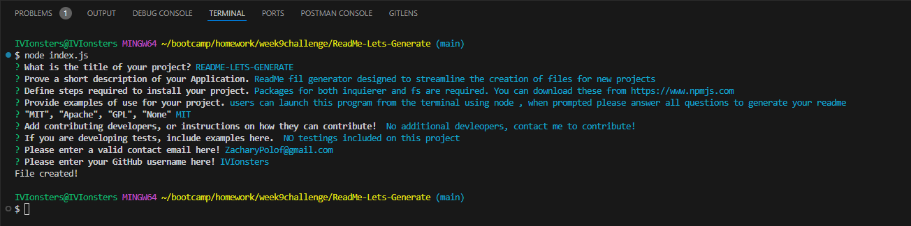
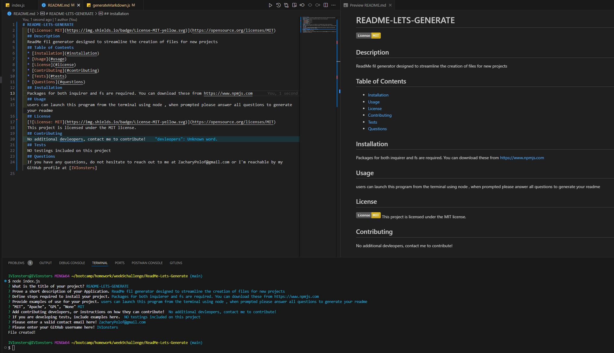

# README-LETS-GENERATE

## Table of Contents

* [Description](#description)
* [Languages](#languages)
* [Features](#features)
* [Usage](#usage)
* [Credits](#credits)
* [License](#license)  

## Description
  Application designed to create a README file from command line, in an effort to speed up the base readme file process for new projects.

## Languages

* 
* 
* 
* 
* 
## Features

* **Node integration:** Simply type node index.js to launch application 
* **Badge Render:** Automatically renders badge for license based on input 
* **Automated ReadMe:** Automatically generates readme based on user input 
* **Console Errors:** Application will automatically log errors and display in terminal if error occurs. 

## Usage

* BOTH inquirer and FS are requried to rune this application. node index.js in the command line to initiate. Video Tutorial below.

* [README-LETS-GENERATE VIDEO DEMO](https://drive.google.com/file/d/1_wbEWtN2dmmtNApcj5gOwFaD5tjUBWwX/view?usp=sharing)

* [README REPO LINK](https://github.com/IVIonsters/ReadMe-Lets-Generate)

* 
* 

## Credits

* [N/A](N/A)

## License

